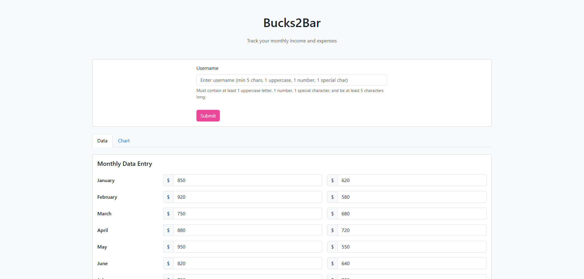
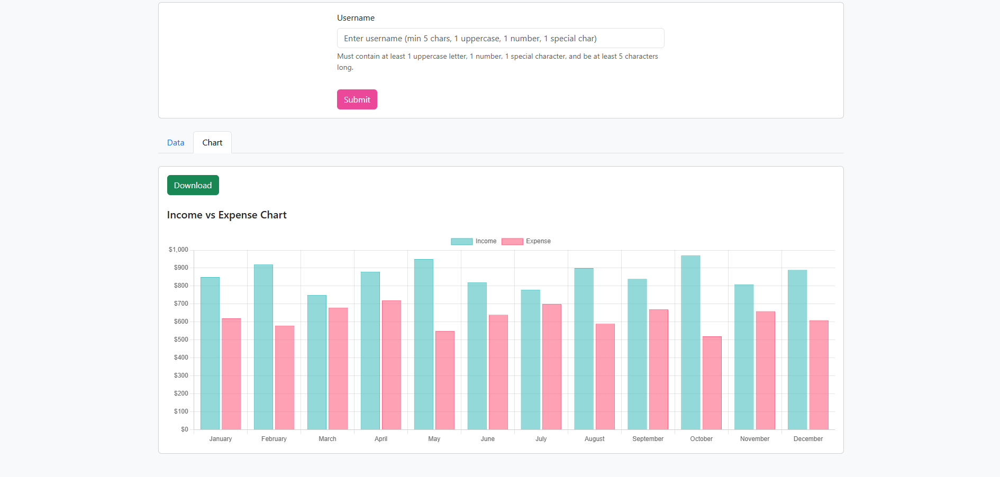

# 💰 Bucks2Bar - Income & Expense Tracker

[](https://github.com/Ahmad-Softwaree/buckes-to-bar-copilot)
[](LICENSE)
[](https://github.com/features/copilot)

> A beautiful, client-side income and expense tracker built with vanilla JavaScript and Chart.js - Created as a learning project to master GitHub Copilot.

## 📸 Screenshots

### Data Tab



### Interactive Chart Visualization



## 🎯 Project Purpose

This project was created as a **learning exercise** to explore and master **GitHub Copilot** for efficient software development. It demonstrates:

- ✅ Building complete features with AI-assisted coding
- ✅ Writing comprehensive unit tests with Copilot
- ✅ Implementing best practices and design patterns
- ✅ Creating production-ready documentation
- ✅ Maintaining clean, readable code

## ✨ Features

- 🔐 **Username Validation** - Secure username creation with multi-rule validation
- 📊 **Monthly Data Entry** - Track income and expenses for all 12 months
- 📈 **Interactive Charts** - Beautiful visualizations with Chart.js
- 💾 **Download Charts** - Export your financial data as PNG images
- 🎨 **Responsive Design** - Bootstrap-powered UI that works on all devices
- ⚡ **No Backend Required** - Runs entirely in the browser
- 🧪 **Fully Tested** - Comprehensive Jest test suite

## 🚀 Quick Start

### Prerequisites

No installation required! Just a modern web browser.

### Running the Application

1. **Clone the repository**

   ```bash
   git clone https://github.com/Ahmad-Softwaree/buckes-to-bar-copilot.git
   cd buckes-to-bar-copilot
   ```

2. **Open in browser**

   ```bash
   # Simply open index.html in your browser
   # Or use a local server (optional)
   python -m http.server 8000
   # Then visit http://localhost:8000
   ```

3. **Start tracking!**
   - Enter a valid username (see validation rules below)
   - Switch to "Data Entry" tab
   - Input your monthly income and expenses
   - View your data visualized in the "Chart" tab
   - Download your chart for record-keeping

## 📋 Username Validation Rules

Your username must meet the following criteria:

- ✓ Minimum **5 characters**
- ✓ At least **1 uppercase** letter (A-Z)
- ✓ At least **1 number** (0-9)
- ✓ At least **1 special character** (!@#$%^&\*()\_+-=[]{}etc.)

**Example valid usernames:** `Admin123!`, `John@2024`, `User#Pass1`

## 🛠️ Tech Stack

| Technology            | Purpose                                  |
| --------------------- | ---------------------------------------- |
| **HTML5**             | Structure and semantic markup            |
| **CSS3**              | Custom styling and responsive design     |
| **Bootstrap 5.3.0**   | UI framework and tab navigation          |
| **JavaScript (ES6+)** | Application logic and DOM manipulation   |
| **Chart.js 4.4.0**    | Data visualization and chart rendering   |
| **Jest 29.7.0**       | Unit testing framework                   |
| **jsdom**             | Browser environment simulation for tests |
| **Bun**               | Fast package manager and test runner     |

## 🧪 Development & Testing

### Install Dependencies

```bash
# Install test dependencies
bun install
# or
npm install
```

### Run Tests

```bash
# Run tests once
bun test

# Watch mode (auto-rerun on changes)
bun test:watch

# Generate coverage report
bun test:coverage
```

### Test Coverage

The project includes comprehensive unit tests covering:

- ✅ Username validation logic
- ✅ Chart update functionality
- ✅ Data input handling
- ✅ Chart download feature
- ✅ Event listeners and user interactions

## 📁 Project Structure

```
bucks-to-bar/
├── index.html              # Main application UI
├── script.js               # Core application logic
├── script.test.js          # Jest unit tests
├── jest.config.js          # Jest configuration
├── package.json            # Dependencies and scripts
├── bun.lock               # Bun lockfile
├── screenshots/           # Project screenshots
│   ├── username-validation.png
│   └── chart-visualization.png
└── .github/
    └── copilot-instructions.md  # GitHub Copilot context
```

## 🎨 Color Scheme

- **Primary (Pink)**: `#ec4899` - Buttons and primary actions
- **Income (Teal)**: `rgba(75, 192, 192, 0.6)` - Income data visualization
- **Expense (Pink/Red)**: `rgba(255, 99, 132, 0.6)` - Expense data visualization

## 🔧 Key Technical Highlights

### 1. **Client-Side Architecture**

No backend required - all data lives in the DOM with no persistence between refreshes.

### 2. **Chart Memory Management**

Properly destroys existing Chart.js instances before creating new ones to prevent memory leaks:

```javascript
if (myChart) {
  myChart.destroy();
}
myChart = new Chart(ctx, {...});
```

### 3. **Auto-Update Chart**

Chart automatically updates when:

- Clicking "Update Chart" button
- Pressing Enter in any input field
- Switching to the chart tab

### 4. **Canvas Export**

Download charts as PNG images using HTML5 Canvas API.

## 🤖 GitHub Copilot Learning Outcomes

This project helped me learn:

1. **AI-Assisted Development** - Using Copilot for rapid feature implementation
2. **Test-Driven Development** - Writing tests with AI suggestions
3. **Documentation Generation** - Creating comprehensive docs with Copilot
4. **Code Patterns** - Learning best practices through AI recommendations
5. **Debugging** - Using Copilot to identify and fix issues
6. **Refactoring** - Improving code quality with AI assistance

## 🚀 Deployment

Deploy to static hosting platforms:

- **GitHub Pages**: Push to `gh-pages` branch
- **Netlify**: Drag and drop or connect repository
- **Vercel**: Import repository and deploy
- **Any static host**: Upload HTML, CSS, and JS files

No build process required!

## 📝 Future Enhancements

- [ ] Add localStorage for data persistence
- [ ] Implement data export to CSV/JSON
- [ ] Add more chart types (line, pie, radar)
- [ ] Dark mode support
- [ ] Multi-currency support
- [ ] Budget goal tracking
- [ ] Monthly reports and summaries

## 👨‍💻 Author

**Ahmad Softwaree**

- GitHub: [@Ahmad-Softwaree](https://github.com/Ahmad-Softwaree)
- Repository: [buckes-to-bar-copilot](https://github.com/Ahmad-Softwaree/buckes-to-bar-copilot)

## 📄 License

This project is licensed under the MIT License - see the [LICENSE](LICENSE) file for details.

## 🙏 Acknowledgments

- **GitHub Copilot** - For AI-powered coding assistance
- **Chart.js** - For beautiful chart visualizations
- **Bootstrap** - For responsive UI components
- **Jest** - For comprehensive testing capabilities

## 💡 Learning Resources

If you're interested in learning GitHub Copilot like I did, check out:

- [GitHub Copilot Documentation](https://docs.github.com/en/copilot)
- [GitHub Copilot Best Practices](https://github.blog/2023-06-20-how-to-write-better-prompts-for-github-copilot/)
- [AI-Assisted Development Guide](https://github.com/features/copilot)

---

⭐ **If this project helped you learn about GitHub Copilot, please give it a star!** ⭐

Made with ❤️ and 🤖 GitHub Copilot
